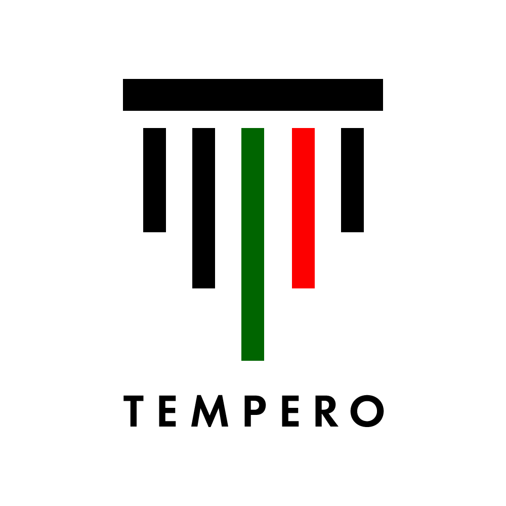

# Tempero Financial Plan

## 1. Overview

This financial plan supports the Tempero business case and pilot at the Nova SBE canteen. It includes operating assumptions, revenue estimates, cost structure, and potential funding support from EU grants.

### Grant funding interest
Tempero is targeting Horizon Europe as the most relevant EU grant source for this project. A Horizon Europe SME/Digital cluster grant would help fund the Nova SBE pilot, document scanning and invoice parsing development, and integration with existing hospitality systems.

## 2. Financial assumptions

- Pilot period: 2 months of Nova SBE testing, followed by broader quarterly rollout.
- Core revenues: subscription access at 39.99€ per user per month and pilot setup fees.
- Key costs: hosting, analytics, salaries, and marketing.
- Other categories such as premium reporting, support labour, office/utilities, legal/accounting, miscellaneous travel, and depreciation are deferred to Year 2.
- Funding support: a Horizon Europe grant will be pursued as supplemental non-dilutive financing.

## 3. Quarterly financial plan

| Category | Period 1 | Period 2 | Period 3 | Period 4 | Year Total |
|---|---|---|---|---|---|
| **Income** | | | | | |
| Subscription revenue | €300 | €300 | €3,600 | €4,800 | €9,000 |
| Pilot consulting / setup | €4,000 | €2,500 | €2,000 | €1,500 | €10,000 |
| EU grant (Horizon Europe) | €5,000 | €0 | €0 | €0 | €5,000 |
| Total income | €9,300 | €2,800 | €5,600 | €6,300 | €24,000 |
| **Cost of Sales** | | | | | |
| Hosting / cloud | €250 | €250 | €250 | €250 | €1,000 |
| Data / attendance analytics | €225 | €225 | €225 | €225 | €900 |
| Total COGS | €475 | €475 | €475 | €475 | €1,900 |
| Gross margin | €8,825 | €2,325 | €5,125 | €5,825 | €22,100 |
| **Operating Expenses** | | | | | |
| Salaries / wages | €4,000 | €4,000 | €4,000 | €4,000 | €16,000 |
| Marketing / advertising | €200 | €200 | €300 | €300 | €1,000 |
| Deferred Year 2 categories | Year 2 | Year 2 | Year 2 | Year 2 | Year 2 |
| Total operating expenses | €4,200 | €4,200 | €4,300 | €4,300 | €17,000 |
| Net operating income | €4,625 | -€1,875 | €825 | €1,525 | €5,100 |
| Income tax estimate | €0 | €0 | €0 | €0 | €0 |
| Net profit (loss) | €4,625 | -€1,875 | €825 | €1,525 | €5,100 |

## 4. Funding support

Tempero will pursue a Horizon Europe grant as supplemental financing rather than primary operating revenue. This grant support is expected to cover:

- pilot delivery and canteen integration costs,
- invoice scanning and document parsing development,
- initial training and reporting for the Nova SBE team.

### Potential grant impact
If awarded, grant funding will reduce the need for early commercial revenue and accelerate product delivery. It also strengthens Tempero’s pitch by showing alignment with EU digital transformation goals.

## 5. Notes

- These figures are illustrative and should be adjusted with actual pilot results.
- The Horizon Europe grant is a target funding opportunity and is not included as guaranteed revenue in the core model.
